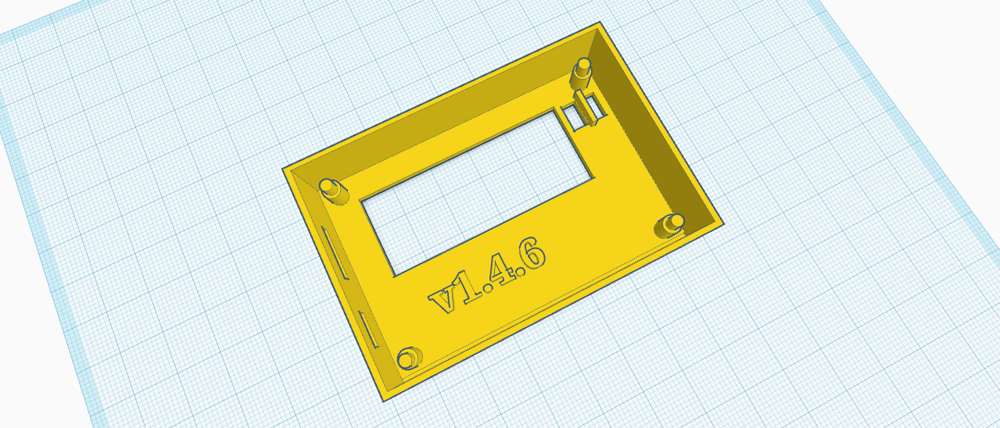

# License

The project is under Attribution-ShareAlike 4.0 International (CC BY-SA 4.0).

# Purpose

-</img>

Enclosure for the Wash Hand PCB board.
See  <a href="https://github.com/konradwilk/wash-hand-pcb">https://github.com/konradwilk/wash-hand-pcb</a>

# Files

 - Wash_Hand_dim.stl is retrieved from <a href="https://github.com/konradwilk/wash-hand-pcb/blob/main/3d/Wash_Hand_dim.stl">
   Wash_Hand_dim.stl</a> which is a representation of the PCB board along with the various outlines.
   This can be used to construct a box around it.

